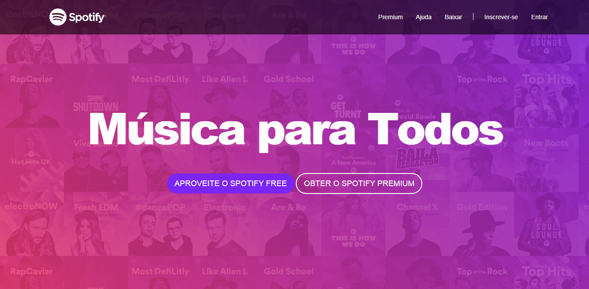
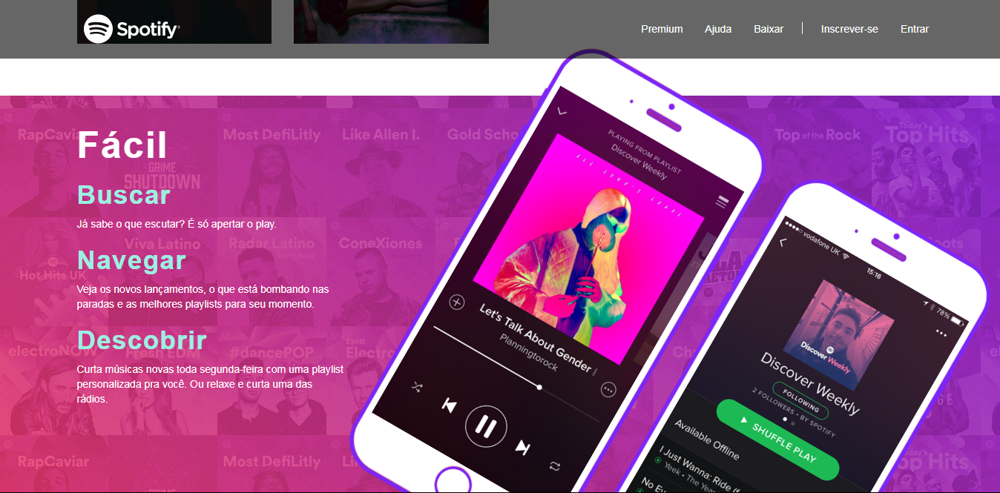

<h1>Clone da página Spotify antiga</h1>

Antes de começar você precisará ter instalado em sua máquina o seguite:

<ul>
    <a href="https://git-scm.com">Git: https://git-scm.com</a>    
         
</ul>

Você também precisará de um editor de texto como o VSCode ou o PHPStorm

### Rodando o Projeto

<ul>
    <li>Abra a pasta do projeto via terminal/cmd</li>
    <li>Abra o arquivo index.html para a visualização do site.</li>
    <li>Para a edição siga um dos passos abaixo:</li>
     

    Execute o comando "code ." sem aspas se você tiver o vscode instalado.
    Ou abra a pasta do projeto no seu editor de texto.
</ul>

### Tecnologias

As seguintes ferramentas foram usadas na construção do projeto:

<ul>
    <li>HTML</li>
    <li>CSS</li>
    <li>Bootstrap</li>
    <li>Javascript</li>
</ul>

### Autor

<a href="">
 
  
 <b>Carlos Eduardo</b></a>

Feito com ❤️ por Carlos Eduardo

<a href="mailto:carloseduardodiasbatista@gmail.com">Entre em contato</a>

